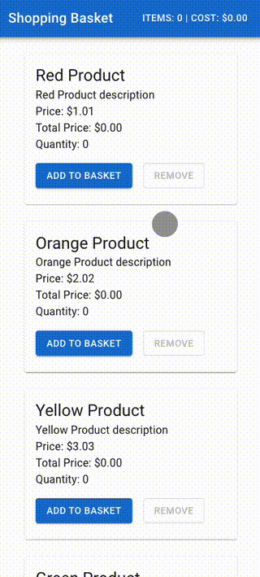
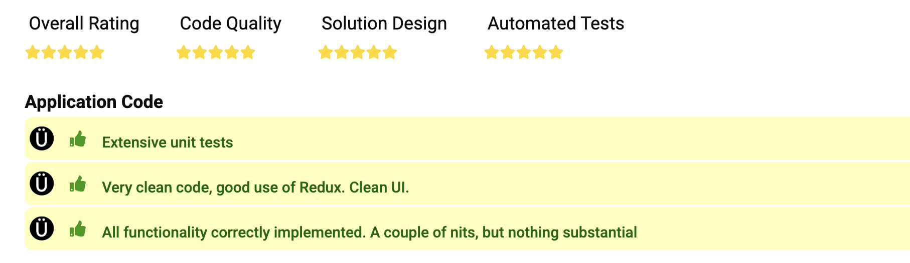

https://app.geektastic.com/code-review/public/86c80e21738bf3d12d12960c29899cffcc2270bb3791c1b72219e6744b9d9984#code-file--1

Basket Checkout Challenge (React / Redux / TypeScript) V2
Challenge
This challenge involves creating a simple shopping basket interface that interacts with specified static mock data (client_utils/sample_json/products_sample.json) on your local machine. Your task is to implement the two views of the application using the specifications outlined below.

There is no specific visual design requirement for the two views. Given the time constraint you should aim to implement functional views using any third party styling libraries or basic styling structures you are comfortable with, adding extra visual styling only if time permits.

You should build the interface components using React and the state solution using Redux. Your code will be reviewed against the specifications outlined below. TypeScript is encouraged but optional.

The two views are:

Product List view. Create a practical set of React components that display that list and allow users to add and remove products to/from a shopping basket state implemented in Redux.

Basket Checkout view. Manage the contents of the basket, including credit card validity checks and complete a rudimentary checkout process.

The data foundation for the app is the list of products provided by the specified static mock data. You can retrieve this list by referring to the JSON mock data file. The (JSON) format of the product list data can be seen in the example file client_utils/sample_json/products_sample.json.

Product List View Requirements
The view should have a header which contains:

The total number of items in the basket
The total cost of those items (sum of product quantity * product price for all products in the basket)
Clicking on either of those items should navigate the user to the Basket Checkout View
The body of the view should contain a list of the products from the specified static data. Each list item should have:

The product name
The product description
The product price
An Add to Basket button which increments the number of items of that product sku in the basket
A Remove Basket button which decrements the number of items of that product sku in the basket
The user should not be able to add more than the ‘basketLimit’ limit amount per product sku.

A Proceed to Checkout button should navigate the user to the Basket Checkout View.

Basket Checkout View Requirements
The view should have a header which contains:

The total number of items in the basket
The body of the view should list the products in the basket. Each item in the list should have:

The product name
The current quantity. This should be implemented as a numeric select field allowing the users to change the quantity of that product. The valid numbers are 1 to ‘basketLimit’ for that product sku.
The product price
The total price for this product (product quantity * product price)
A Remove All button should remove this product entirely from the basket
The total cost of all items (sum of product quantity * product price for all products in the basket) should be shown beneath the list in (2).

There should be a text field for the user to enter a credit card number. This number should be 16 digits long to be valid. This number should be checked on the client to ensure it’s 16 digits long.

If the number is valid the user should be able to checkout
If the number is invalid then there should be some sort of visual indication to the user of this state (you may implement your choice of solution for this aspect)
A Continue Shopping link should navigate back to the Product List view.

A Checkout button should just be mocked to return successfully. If the basket is empty the user should not be able to click the Checkout button.

To help visualise the overall application, we have provided examples of the two views “Product List View.pdf” and “Checkout View.pdf”

Note that you do not need to replicate those views exactly in terms of look and feel - they are just examples of how the two views might look with specific styling to highlight some of the required functionality.

Please include in your submission any tests that you write whilst building out your solution.
